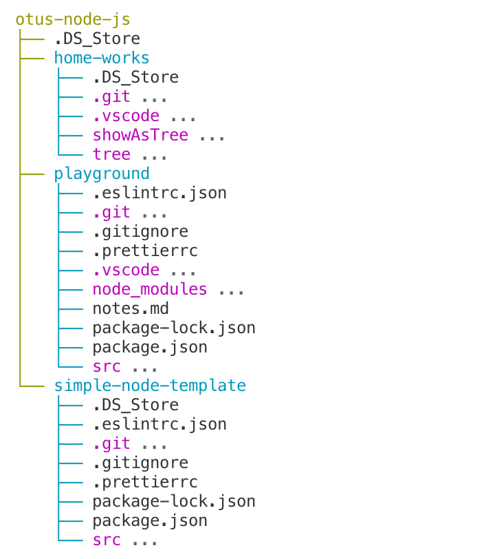

# Tree

Displays a directory as a tree.

## Install

`git clone https://github.com/borolgs/otus-nodejs.git`  
`cd tree`  
`npm i`  
`npm link`

## Usage

Help  
`tree -h`

Show current directory  
`tree .`

Show specified directory  
`tree path/to/directory`

Show specified directory with limit the depth  
`tree path/to/directory -d=3`
